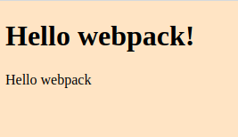

# Yuriy Chamkoriyski webpack setup project

> Creating a template with webpack for future projects

In this exercise you will build a simple yet powerful webpack boilerplate, which you can later use as a starting point in your projects.

## Instructions:

- First set up a new GitHub repository for this exercise.
- Follow the instructions from the getting [started guide](https://webpack.js.org/guides/getting-started/#basic-setup) to set up the basics. Implement all the steps from Basic Setup to NPM Scripts.

## Add HTML:

- You already know that all the distribution files will be placed in /dist directory. You also know that you should not create files manually in the /dist folder, as there's a risk they will be overwritten. Therefore, install the HtmlWebpackPlugin to automatically create the index.html file in the /dist directory.
- Follow the instructions from the . Be extra careful when updating the module.exports object in your webpack.config.js file, to not to make any nesting mistakes.
- Now delete all the files from the /dist directory and run:
`npm run build`

## Setup local dev server

Finally, it's time to improve your developer experience. When working on the project you will not want to run the build command from the terminal every time you make a change in the code. Therefore go ahead and install a webpack dev server, which will watch your source files, generate compiled distribution files and even refresh the browser every time you save changes in the source code.

- Follow the  guide and set it up on your local machine. Again, be cautious with updating the module.exports object in your webpack.config.js.
- Once these steps are complete, you should see your application working at: http://localhost:8080/. Every change you make in js or css files now should be reflected in a browser a few seconds later.

## Built With

- Major languages: HTML, CSS, JS
- Frameworks: none
- Technologies used: Git, webpack

## Live Demo

- Not deployed yet.

## Getting Started

To get a local copy up and running follow these simple example steps.

### Prerequisites

- Internet connection and browser
- A text editor(preferably Visual Studio Code)
- Browser

### Setup

- For detail description of how to get started with webpack, please, look at: [webpack](https://webpack.js.org/guides/getting-started/)

### Install

- [Git](https://git-scm.com/downloads)
- [Node](https://nodejs.org/en/download/)

### Usage

- Clone the repository using "git clone git@github.com:Hombre2014/Webpack-Setup.git"
- Change directory into the project folder
- Run npm install
- Run npm start
- A new browser will open automatically with application loaded

### Run tests

- N/A

### Deployment

- All the files necessary for deployment are in the /dist folder

## Author

👤 **Yuriy Chamkoriyski**

- GitHub: [@Hombre2014](https://github.com/Hombre2014)
- Twitter: [@Chamkoriyski](https://twitter.com/Chamkoriyski)
- LinkedIn: [axebit](https://linkedin.com/in/axebit)

## 🤝 Contributing

Contributions, issues, and feature requests are welcome!

Feel free to check the [issues page](https://github.com/Hombre2014/Webpack-Setup/issues).

## Show your support

Give a ⭐️ if you like this project!

## Acknowledgments

## 📝 License

This project is [MIT](./license.md) licensed.